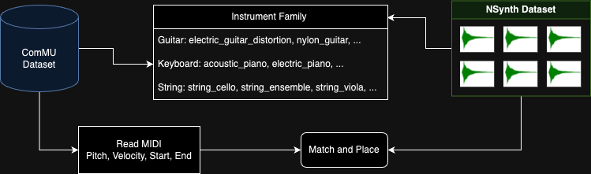

# Synthesized-ComMU Dataset (SCM)



This is the repository of Synthesized-ComMU Dataset (SCM). This dataset was created by synthesizing midi from the ComMU[1] dataset with audio note files from the NSynth[2] dataset. 
Links to both datasets are provided below.

- ComMU Dataset [[Paper]](https://arxiv.org/pdf/2211.09385.pdf) [[Dataset]](https://github.com/POZAlabs/ComMU-code)
- NSynyh Dataset [[Paper]](https://arxiv.org/pdf/1704.01279.pdf) [[Dataset]](https://magenta.tensorflow.org/datasets/nsynth#files)

### MIDI to Audio Rendering

Rendering the midi I used into audio can be found [here](https://github.com/spear011/NSynth-MIDI-Renderer-for-massive-MIDI-dataset.git)

## Dataset Overview

- Number of Samples: 130,440
  - Train: 129,600
  - Val: 240
  - Test: 600

- Features: Contains all metadata extracted from the midi provided by ComMU, as well as information about the NSynth presets used.

- Classes: 6 perfectly balanced Track Role
  - Main/Sub Melody, Accompaniment, Pad, Bass, Riff

## Getting Started

### Setup
1. Clone this repository
2. Download Datasets (ComMU, NSynth)
3. Install required packages
    ```
    pip install -r requirements.txt
    ```

## Preparation
- The ComMU dataset can be preprocessed to achieve balanced Track role classes.
    ```
    $ python preparation.py data-folder
    ```
- After successful preprocessing, project tree would be like this,
  ```
    .
    ├── commu_meta.csv
    ├── commu_midi
    └── balanced
        ├── balanced_meta.csv
        ├── train
        │   ├── raw
        ├── valid
        │   ├── raw
        └── test
            └── raw

    ```

## Augmentation
- You can augment training data provided by the [[ComMU-code]](https://github.com/POZAlabs/ComMU-code). The augmentation process will only involve the training data.
    '''
    $ python preprocess.py --root_dir ./data-folder/balanced --csv_path ./data-folder/balanced/balanced_meta.csv
    ```
